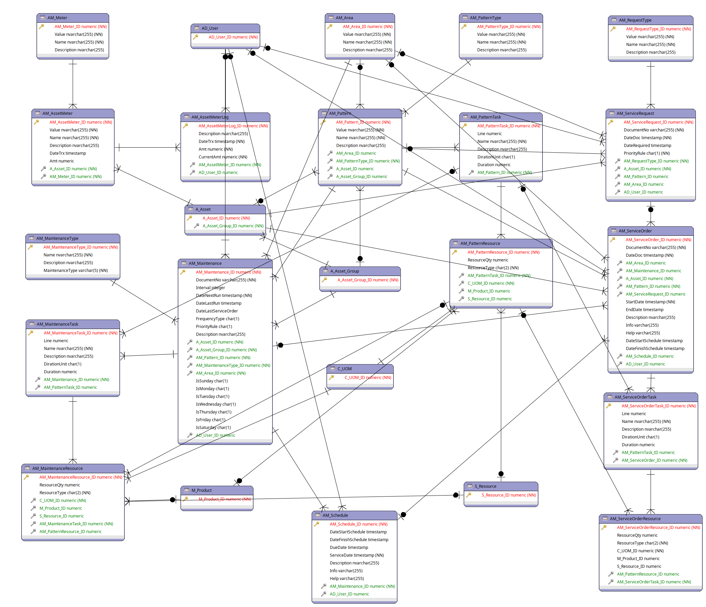

# ADempiere Enterprise Asset Management

Enterprise asset management (EAM) is the optimal lifecycle management of the physical assets of an organization. It covers subjects including the design, construction, commissioning, operations, maintenance and decommissioning/replacement of plant, equipment and facilities. 

## Getting Started

- Download and install ADempiere last versión from [https://github.com/adempiere/adempiere/releases](https://github.com/adempiere/adempiere/releases)
- Download adempiereEAM project using git user git clone [https://github.com/adempiere/adempiereEAM](https://github.com/adempiere/adempiereEAM)
- use gradle for build
- Run it

## License
This project have License GNU/GPLv2 or later.